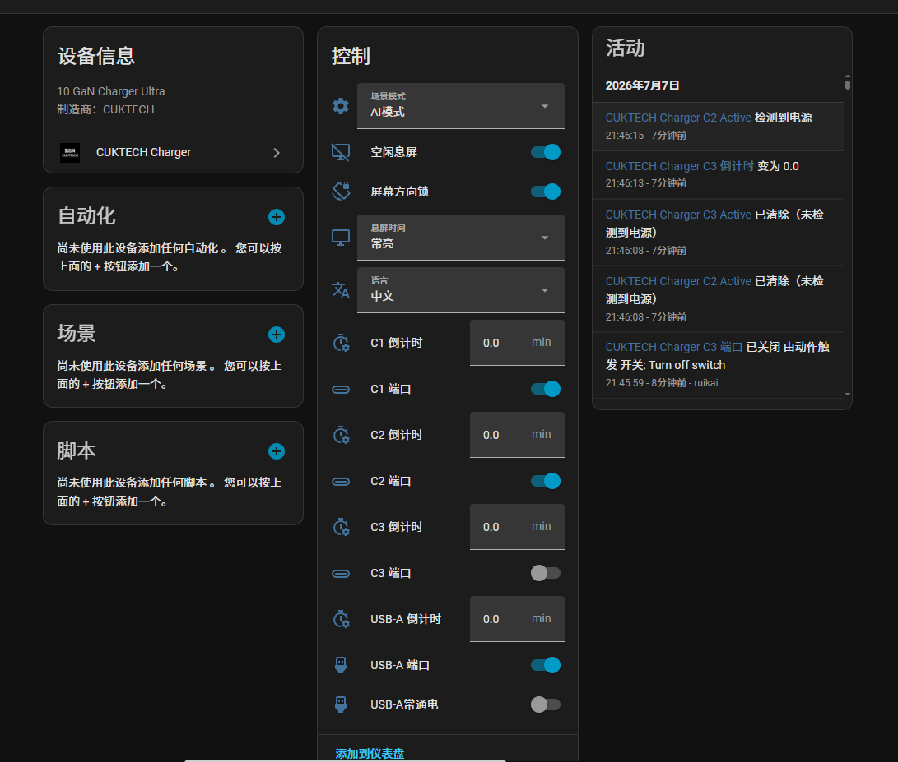
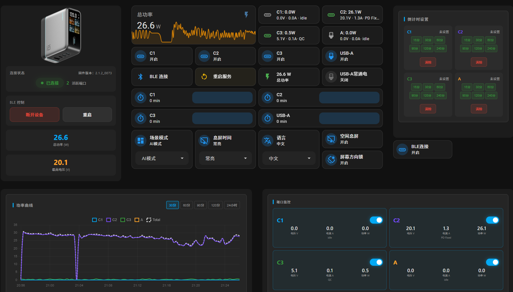

# CUKTECH 10 GaN Charger Ultra - Home Assistant Integration

[](LICENSE)
[](https://www.python.org/downloads/)
[](https://www.home-assistant.io/)

[](https://my.home-assistant.io/redirect/hacs_repository/?owner=kairui1108&repository=cuktech-ble-ha-integration&category=integration)
[](https://my.home-assistant.io/redirect/config_flow_start/?domain=cuktech_charger)

通过 BLE（低功耗蓝牙）将 CUKTECH 10 GaN Charger Ultra 充电器接入 Home Assistant，实现实时功率监控、端口控制和自动化。

支持两种网关方案：**Python BLE Server**（运行在 Linux/Docker）或 **ESP32 BLE Bridge**（独立硬件）。


## 功能特性

### BLE Server（Python）
- **实时功率监控**：通过 MQTT 推送电压、电流、功率数据
- **功率曲线图**：Web UI 实时显示各端口及总功率曲线
- **端口控制**：远程开关 C1/C2/C3/A 端口
- **协议开关控制**：独立控制各端口的 PD/PPS/UFCS/SCP 协议开关
- **倒计时设置**：为每个端口设置充电倒计时（支持自定义分钟数）
- **设置管理**：场景模式、息屏时间、语言等设置
- **BLE 自动重连**：断开后自动重连，指数退避策略
- **MQTT LWT**：崩溃时自动通知 HA 设备离线
- **巴法云 (Bemfa) 接入**：支持小爱同学/小度音箱语音控制充电器端口
- **SQLite 历史数据**：端口数据持久化存储，支持统计和导出

### ESP32 固件
- **独立硬件**：ESP32 直连充电器，无需主机
- **Web 配置**：首次启动 AP 配网模式，浏览器配置凭据
- **Web 仪表盘**：实时端口电压/电流/功率
- **端口控制**：Web 或 MQTT 控制各端口
- **协议开关**：独立开关 PD / PPS / UFCS / SCP
- **场景模式切换**
- **HTTP OTA 更新**
- **巴法云 (Bemfa) 接入**：支持小爱同学/小度音箱语音控制
- **支持芯片**：ESP32 / ESP32-S3 / ESP32-C3
- 👉 **[cuktech-ble-esp32](https://github.com/kairui1108/cuktech-ble-esp32)** — 固件下载

### HA Integration
- **BLE 连接控制**：开关实体控制 BLE 连接/断开，二进制传感器显示连接状态
- **端口传感器**：电压、电流、功率、协议类型
- **端口控制**：开关控制 C1/C2/C3/A 端口
- **协议开关控制**：10 个开关实体，独立控制各端口 PD/PPS/UFCS/SCP 协议
- **设置管理**：场景模式、息屏时间、语言等选择器
- **倒计时设置**：数字实体控制各端口充电倒计时
- **设备信息同步**：型号、固件版本从 BLE 服务器实时同步

### Web 管理界面
- 实时功率曲线图（各端口 + 总功率）
- 端口开关控制
- BLE 连接/断开控制
- 设备设置管理
- 倒计时设置（支持自定义和快捷选择）
- 日志级别管理

### 已知限制

- **单设备**：当前架构仅支持同时连接一个充电器
- **协议检测**：充电协议基于端口电压和 PDO 数据推断，仅供参考
- **平台支持（Python BLE Server）**：开发与测试基于 Linux 环境

## 架构说明

```
┌─────────────────┐     ┌─────────────────────┐     ┌─────────────────┐
│  CUKTECH 10 GaN │───▶│   BLE Gateway       │───▶│  Home Assistant │
│     Charger     │ BLE │  (Python / ESP32)   │ MQTT│    Integration  │
└─────────────────┘     └─────────────────────┘     └─────────────────┘
                              │
                              │ HTTP API / Web UI
                              ▼
                        ┌─────────────┐
                        │  Web 界面   │
                        └─────────────┘
```

- **BLE Server**（Python）：运行在 Linux/Docker 主机上，功能完整（含历史数据）
- **ESP32 固件**：独立运行在 ESP32 上，低功耗、低成本
- **HA Integration**：订阅 MQTT 数据，两条路径通用

## 目录结构

```
cuktech-ble-ha/
├── ble_server/                    # BLE 服务端
│   ├── src/cuktech_ble/
│   │   ├── protocol.py            # BLE 协议常量和工具
│   │   ├── controller.py          # BLE 连接和命令处理
│   │   └── cli.py                 # CLI 用户界面
│   ├── ha_server.py               # HTTP API + MQTT 服务
│   ├── ble_manager.py             # BLE 连接管理
│   ├── state.py                   # 状态管理
│   ├── state_protocol_v2.py       # 协议检测引擎 V2
│   ├── history.py                 # SQLite 历史数据
│   ├── config.py                  # 配置（支持 YAML）
│   ├── bemfa_client.py            # 巴法云 MQTT 客户端（小爱/小度）
│   ├── config.yaml.example        # 配置模板
│   ├── check_env.sh               # 环境检查脚本
│   ├── cuktech_ctl.sh             # 服务控制脚本
│   ├── web/
│   │   ├── index.html             # 桌面端 Web 界面
│   │   ├── phone.html             # 移动端 Web 界面
│   │   └── static/                # 前端资源 (JS/CSS/图片)
│   ├── docker/                    # Docker 部署文件
│   ├── tests/                     # 单元测试 (135 tests)
│   └── systemd/                   # systemd 服务配置
│
├── ha_integration/                # HA 自定义集成
│   └── custom_components/cuktech_charger/
│       ├── __init__.py            # Coordinator
│       ├── binary_sensor.py       # 端口状态 + BLE 连接状态
│       ├── config_flow.py         # 配置流程（支持 reauth）
│       ├── const.py               # 常量定义
│       ├── manifest.json
│       ├── number.py              # 倒计时数字实体
│       ├── select.py              # 选择器实体
│       ├── sensor.py              # 传感器实体
│       ├── switch.py              # 开关实体 + BLE 连接控制
│       ├── strings.json           # 英文翻译
│       ├── translations/          # 多语言翻译
│       ├── brand/                 # HACS 品牌图标
│       └── icon.png
│
├── esp32_ble/                     # ESP32 固件
│   ├── main/
│       ├── main.c                 # WiFi/MQTT/HTTP/OTA
│       ├── ble_manager.c          # BLE 状态机 + 异步命令
│       └── ...
│
├── docs/                          # 文档
│   ├── server-readme.md
│   ├── server-readme-en.md
│   ├── integration-readme.md
│   ├── integration-readme-en.md
│   ├── esp32-readme.md
│   ├── esp32-readme-en.md
│   └── tools/                     # CLI 测试工具
│
├── LICENSE
├── README.md
├── RELEASE_NOTES.md
└── bump-version.sh
```

## Docker 部署

Docker 部署无需安装 Python 依赖，只需确保宿主机已安装 Docker 和蓝牙适配器。

**拉取镜像直接运行：**

```bash
# 创建配置文件
cat > config.yaml << EOF
ble:
  mac: "XX:XX:XX:XX:XX:XX"
  token: "your_token_12bytes_hex"
  ble_key: "your_ble_key_16bytes_hex"
mqtt:
  # 设置为 true 启用 MQTT（用于 Home Assistant 集成），false 则作为独立 web 服务运行
  enabled: true
  host: ""
  port: 1883
  username: ""
  password: ""
  keepalive: 60
  topic_prefix: "cuktech/charger"

server:
  host: "0.0.0.0"
  port: 8199
  command_timeout: 10.0
  reconnect_base_delay: 1.0
  reconnect_max_delay: 300.0
  settings_refresh_interval: 60.0
  log_level: "error"
  history_retention_days: 2
  history_db_path: ""

EOF

# 运行容器
docker run -d \
  --name cuktech-ble \
  --network host \
  --privileged \
  --restart unless-stopped \
  -v $(pwd)/config.yaml:/app/config.yaml:ro \
  -v $(pwd)/data:/data \
  -v /var/run/dbus/system_bus_socket:/var/run/dbus/system_bus_socket:ro \
  -e CUKTECH_HISTORY_DB_PATH=/data/port_history.db \
  ghcr.io/kairui1108/cuktech-ble-server:latest

# 查看日志
docker logs -f cuktech-ble
```

**Docker Compose 拉取运行（推荐）：**

```bash
# 编辑配置，填入你的设备信息
vim ble_server/docker/docker-compose.pull.yml

# 直接拉取镜像并启动（无需本地构建）
sudo docker compose -f ble_server/docker/docker-compose.pull.yml up -d
```

**本地构建运行：**

```bash
cd ble_server
# 使用配置文件的方式运行，编辑 config.yaml 填入你的设备信息
cp config.yaml.example config.yaml
docker compose -f docker/docker-compose.yml up -d

# 使用环境变量的方式运行，修改 docker-compose.env.yml 填入你的设备信息
docker compose -f docker/docker-compose.env.yml up -d
```

## 安装步骤

### 1. 获取设备 Token 和 BLE Key

使用 [Xiaomi-cloud-tokens-extractor](https://github.com/PiotrMachowski/Xiaomi-cloud-tokens-extractor) 从米家云端获取设备信息：

```bash
pip install xiaomi_cloud_tokens_extractor
python -m xiaomi_cloud_tokens_extractor
```

选择你的 CUKTECH 充电器，获取：
- `MAC` - 设备蓝牙 MAC 地址
- `Token` - 设备 Token（12 字节 hex）
- `BLE Key` - BLE 认证密钥（16 字节 hex）

### 2. 检查环境

```bash
cd ble_server
./check_env.sh
```

确认 Python、蓝牙适配器、BLE 支持等全部通过。

### 3. 部署 BLE Server

```bash
cd ble_server

python3 -m venv .venv
source .venv/bin/activate
pip install -e .
```

#### 配置方式（二选一）

**方式 A：YAML 配置文件（推荐）**

```bash
cp config.yaml.example config.yaml
# 编辑 config.yaml 填入你的配置
```

**方式 B：环境变量**

```bash
export CUKTECH_DEVICE_MAC="XX:XX:XX:XX:XX:XX"
export CUKTECH_DEVICE_TOKEN="your_token_here"
export CUKTECH_DEVICE_BLE_KEY="your_ble_key_here"
export MQTT_HOST="your_mqtt_broker"
export MQTT_PORT="1883"
export MQTT_USER="your_username"
export MQTT_PASS="your_password"
```

> 优先级：环境变量 > config.yaml

```bash
./cuktech_ctl.sh start
```

### 4. 安装 HA 集成

**方式 A：HACS 安装（推荐）**

1. 点击上方 **[Open in HACS]** 按钮，将本仓库添加为自定义集成
2. 安装后重启 Home Assistant
3. 点击 **[Add integration]** 按钮，搜索 "CUKTECH Charger" 添加

**方式 B：手动安装**

```bash
cp -r ha_integration/custom_components/cuktech_charger /config/custom_components/
```

重启 Home Assistant。

## 实体说明

| 实体类型 | 实体名 | 功能 |
|----------|--------|------|
| switch | 连接控制 | BLE 连接/断开 |
| binary_sensor | 连接状态 | BLE 连接状态 |
| sensor | 端口电压/电流/功率 | 实时监控 |
| sensor | 端口协议 | PD/QC/USB-A |
| sensor | 总功率 | 所有端口功率之和 |
| switch | 端口控制 | 开关 C1/C2/C3/A |
| switch | 协议开关 (×10) | 独立控制各端口 PD/PPS/UFCS/SCP |
| select | 场景模式 | AI/数码/单口/均衡 |
| select | 息屏时间 | 5分钟/1分钟/10分钟等 |
| number | 倒计时 | 各端口充电倒计时 |

## API 接口

| 端点 | 方法 | 说明 |
|------|------|------|
| `/api/status` | GET | 获取充电器状态 |
| `/api/enable` | POST | 启用/禁用 BLE 连接 |
| `/api/set` | POST | 设置 PIID 值 |
| `/api/port` | POST | 控制端口开关 |
| `/api/protocol` | POST | 控制协议开关（toggle/set/bulk/value） |
| `/api/chart` | GET | 获取图表数据 |
| `/api/history/{port}` | GET | 查询历史数据 |
| `/api/statistics/{port}` | GET | 统计分析 |
| `/api/export/{port}` | GET | CSV 导出 |
| `/api/log-level` | GET/POST | 日志级别管理 |

## MQTT 主题

| 主题 | 说明 |
|------|------|
| `cuktech/charger/port/{c1\|c2\|c3\|a}` | 端口数据（retain） |
| `cuktech/charger/settings` | 设置数据（retain） |
| `cuktech/charger/status` | 连接状态（retain + LWT） |
| `cuktech/charger/set` | 设置命令（订阅） |
| `cuktech/charger/port` | 端口控制命令（订阅） |

## 依赖

### BLE Server
- Python 3.10+
- bleak >= 0.21
- paho-mqtt >= 2.0
- aiohttp >= 3.9
- cryptography >= 41
- pyyaml >= 6.0

### HA Integration
- Home Assistant 2024.1+
- MQTT（集成依赖）

## 测试

```bash
# BLE Server (135 tests)
cd ble_server && .venv/bin/python -m pytest tests/

# HA Integration (87 tests)
cd ha_integration && python -m pytest tests/
```

## 效果预览





## 许可证

MIT License - 详见 [LICENSE](LICENSE) 文件

## 致谢

- [cuktech-ble-controller](https://github.com/zhyzhaogit/cuktech-ble-controller) - BLE 协议参考实现
- [ha-cuk-ble](https://github.com/zuyan9/ha-cuk-ble) - 协议检测参考
- [Xiaomi-cloud-tokens-extractor](https://github.com/PiotrMachowski/Xiaomi-cloud-tokens-extractor) - 小米设备 Token 提取工具
- [bleak](https://github.com/hbldh/bleak) - BLE 通信库
- [paho-mqtt](https://eclipse.dev/paho/) - MQTT 客户端
